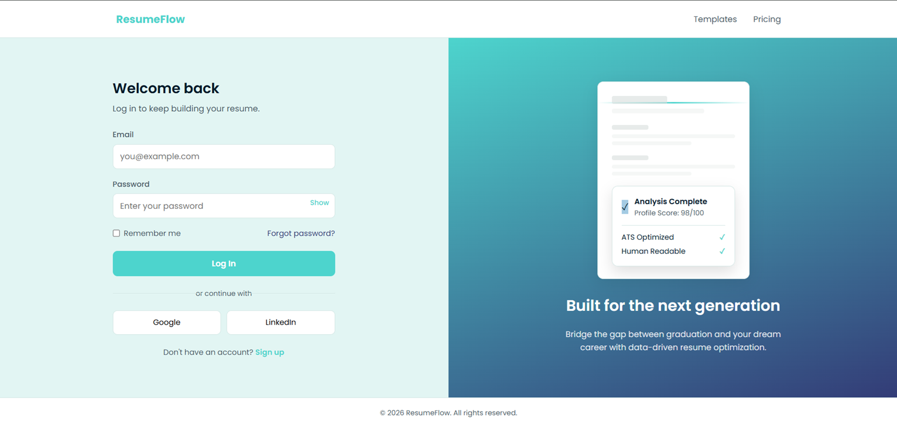
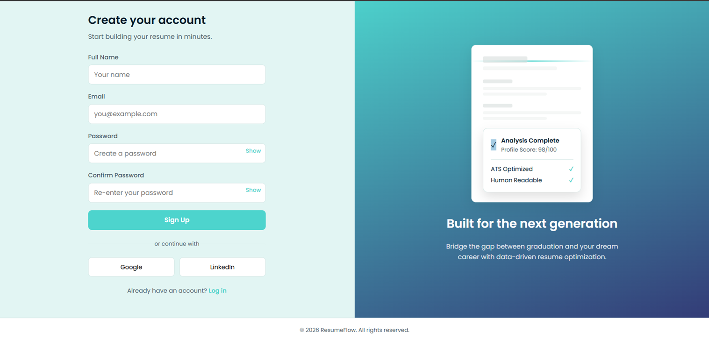

# ResumeFlow Landing Page

A responsive and modern landing page for a fictional resume builder called **ResumeFlow**. This project was built as part of my internship assignment by following the provided PRD and recreating the reference design as closely as possible using semantic HTML, CSS, and vanilla JavaScript.

---

## 🌐 Live Demo

 **[View Live Project](https://tanushreenegi-dev.github.io/resume-landing/)**

---

## 📸 Project Preview

### Landing Page


### Login Page


### Sign Up Page


---

##  About the Project

The objective of this assignment was to recreate a professional landing page by carefully following the given PRD and reference design. I focused on writing clean, semantic HTML, creating a responsive layout, and organizing the code into separate HTML, CSS, and JavaScript files.

After completing the project, I reviewed the feedback, fixed the suggested issues, and updated the project to improve both functionality and code quality. I later extended the project by adding fully functional **Login** and **Sign Up** pages, wiring up navigation between pages, and exploring browser storage (Cookies, Local Storage, Session Storage, IndexedDB).

---

## ✨ Features

```text
Landing Page
│── Sticky navigation bar
│── Hero section with call-to-action
│── Trusted companies section
│── Statistics cards
│── Features section
│── How It Works section
│── Resume template cards
│── Success stories/testimonials
│── FAQ section (using <details> and <summary>)
│── Responsive footer
└── Current year auto-displayed via JavaScript

Login & Signup
│── Login page (email/password fields)
│── Sign Up page (name, email, password, confirm password)
└── Show/hide password toggle (single reusable function using data-target)

Browser Storage
│── Dark/Light mode toggle → saved in Local Storage
│── Login form email → remembered using Session Storage
└── Notes page → backed by IndexedDB
```

---

## Login & Signup Pages

After finishing the landing page, I designed and built separate `login.html` and `signup.html` pages to match the ResumeFlow brand.

Key decisions while building this part:
- Kept login and signup as **two separate HTML pages** instead of toggling between them with JavaScript, so the browser back button and URLs behave normally.
- Used the same CSS variables (`--accent`, `--accent-2`) as the main site so the auth pages stay visually consistent with the landing page.
- Added a right-side visual panel showing a resume being "scanned" for ATS compatibility, with a subtle animated line and a results card — this ties directly into what ResumeFlow actually does, instead of using a generic decorative graphic.
- Wired up the navbar "Log In" and "Start Free" buttons on the homepage so they actually take you to `login.html` and `signup.html`.

---

## Browser Storage — Cookies, Local Storage, Session Storage, IndexedDB

As part of exploring how browsers store data, I looked into and implemented four different storage mechanisms on this project.

### Cookies
Checked the Cookies section under DevTools → Application tab. Since this site is static (hosted on GitHub Pages) and there's no backend setting a session, the cookies table was empty. Cookies are usually set by a backend server (like a login session), so if this frontend gets connected to `resume-api` in the future, cookies would show up here.


### Local Storage — Theme Toggle
Added a Dark/Light mode button in the navbar. When clicked, the selected theme is saved in Local Storage under the `theme` key. Because Local Storage persists even after closing the browser, the selected theme stays applied the next time the site is opened.


### Session Storage — Login Form
On the login page, whatever is typed into the email field gets saved temporarily in Session Storage under the `tempEmail` key. If the page is accidentally refreshed, the typed email is restored automatically. Unlike Local Storage, this data clears itself once the tab is closed.


### IndexedDB — Notes Page
Built a separate `notes.html` page to store simple resume-related notes using IndexedDB (`resumeNotesDB` database, `notes` object store). Notes can be added and deleted, and they persist even after refreshing or closing the page — useful for structured data that's too much for Local/Session Storage to handle cleanly.


**What I took away from this:** Session Storage is best for short-lived, per-tab data (like an in-progress form). Local Storage is better for small values that should persist across visits (like a theme preference). IndexedDB is the right tool once the data becomes structured or larger, like a list of notes.

---

## Technologies Used

- HTML5
- CSS3
- CSS Grid
- Flexbox
- Vanilla JavaScript
- Browser Storage APIs (Cookies, Local Storage, Session Storage, IndexedDB)

---

## 📂 Folder Structure

```text
resume-landing/
│── index.html
│── login.html
│── signup.html
│── notes.html
│── style.css
│── login.css
│── script.js
│── login.js
│── README.md
├── images/
│   ├── screenshot.png
│   ├── login.png
│   ├── signup.png
│   ├── icon-ats.svg
│   ├── icon-fast.svg
│   ├── icon-mobile.svg
│   ├── icon-share.svg
│   └── icon-target.svg
└── screenshots/
    ├── cookies-check.png
    ├── local-storage-theme.png
    ├── session-storage-email.png
    └── indexeddb-notes.png
```

---

##  What I Learned

Working on this project gave me practical experience in building a complete landing page from scratch.

Some of the things I learned are:

- Writing cleaner and more meaningful HTML using semantic elements.
- Understanding where Flexbox works better and where CSS Grid is more suitable.
- Organizing CSS into reusable styles instead of repeating code.
- Using CSS variables to maintain consistent colors and spacing.
- Making the website responsive using media queries.
- Keeping HTML, CSS, and JavaScript in separate files for better code organization.
- Using JavaScript to add small dynamic features like automatically displaying the current year in the footer.
- Testing the live deployment and fixing issues after receiving feedback.
- The difference between Cookies, Local Storage, Session Storage, and IndexedDB, and when to use each one.
- Using Chrome DevTools' Application tab to inspect and verify stored data.

---

## Challenges I Faced

While building this project, I came across a few challenges.

- Matching the layout with the reference design and keeping every section responsive.
- Debugging the JavaScript when the footer year wasn't displaying correctly.
- Designing the login/signup pages to feel polished and original rather than like a generic template, which took a few redesign rounds.
- A couple of file-renaming and browser caching issues while restructuring the project.
- Figuring out why Session Storage looked empty at first — turned out Chrome's autofill doesn't always trigger the `input` event the same way manual typing does.

Solving these challenges helped me improve my debugging skills and understand the importance of testing before submitting a project.

---

## Future Improvements

If I continue working on this project, I would like to:

- Add smooth scrolling animations.
- Turn the landing page into a functional resume builder.
- Improve accessibility further.
- Connect the login/signup forms to a real backend for authentication.
- Move notes from IndexedDB into `resume-api` so they sync across devices.

---

## Acknowledgement

This project was completed as part of my internship assignment. It helped me strengthen my understanding of semantic HTML, responsive layouts, CSS Grid, Flexbox, JavaScript basics, debugging, browser storage, and deploying projects using GitHub Pages.
