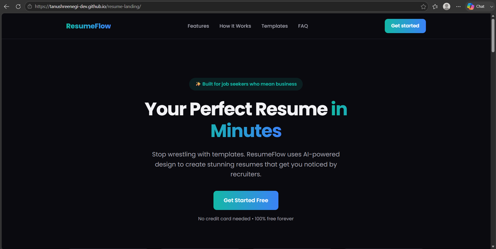

# ResumeFlow Landing Page

A responsive and modern landing page for a fictional resume builder called **ResumeFlow**. This project was built as part of my internship assignment by following the provided PRD and recreating the reference design as closely as possible using semantic HTML, CSS, and vanilla JavaScript.

---

## 🌐 Live Demo

👉 **[View Live Project](https://tanushreenegi-dev.github.io/resume-landing/)**

---

## 📸 Project Preview



---

## 📖 About the Project

The objective of this assignment was to recreate a professional landing page by carefully following the given PRD and reference design. I focused on writing clean, semantic HTML, creating a responsive layout, and organizing the code into separate HTML, CSS, and JavaScript files.

After completing the project, I reviewed the feedback, fixed the suggested issues, and updated the project to improve both functionality and code quality.

---

## ✨ Features

- Responsive landing page
- Sticky navigation bar
- Hero section with call-to-action
- Trusted companies section
- Statistics cards
- Features section
- How It Works section
- Resume template cards
- Success stories/testimonials
- FAQ section using `<details>` and `<summary>`
- Responsive footer
- Automatically displays the current year using JavaScript

---

## 🛠️ Technologies Used

- HTML5
- CSS3
- CSS Grid
- Flexbox
- Vanilla JavaScript

---

## 📂 Folder Structure

```text
resume-landing/
│── index.html
│── style.css
│── script.js
│── README.md
└── images/
    ├── screenshot.png
    ├── icon-ats.svg
    ├── icon-fast.svg
    ├── icon-mobile.svg
    ├── icon-share.svg
    └── icon-target.svg
```

---

## 📚 What I Learned

Working on this project gave me practical experience in building a complete landing page from scratch.

Some of the things I learned are:

- Writing cleaner and more meaningful HTML using semantic elements.
- Understanding where Flexbox works better and where CSS Grid is more suitable.
- Organizing CSS into reusable styles instead of repeating code.
- Using CSS variables to maintain consistent colors and spacing.
- Making the website responsive using media queries.
- Keeping HTML, CSS, and JavaScript in separate files for better code organization.
- Using JavaScript to add small dynamic features like automatically displaying the current year in the footer.
- Testing the live deployment and fixing issues after receiving feedback.

---

## 🚧 Challenges I Faced

While building this project, I came across a few challenges.

- Matching the layout with the reference design.
- Maintaining proper spacing and alignment throughout the page.
- Making every section responsive on different screen sizes.
- Debugging the JavaScript when the footer year wasn't displaying correctly.
- Reviewing the project and implementing improvements based on mentor feedback.

Solving these challenges helped me improve my debugging skills and understand the importance of testing before submitting a project.

---

## 🚀 Future Improvements

If I continue working on this project, I would like to:

- Add smooth scrolling animations.
- Turn the landing page into a functional resume builder.
- Improve accessibility further.
- Add a dark/light mode toggle.
- Connect the form with a backend.

---

## 🙏 Acknowledgement

This project was completed as part of my internship assignment. It helped me strengthen my understanding of semantic HTML, responsive layouts, CSS Grid, Flexbox, JavaScript basics, debugging, and deploying projects using GitHub Pages.
